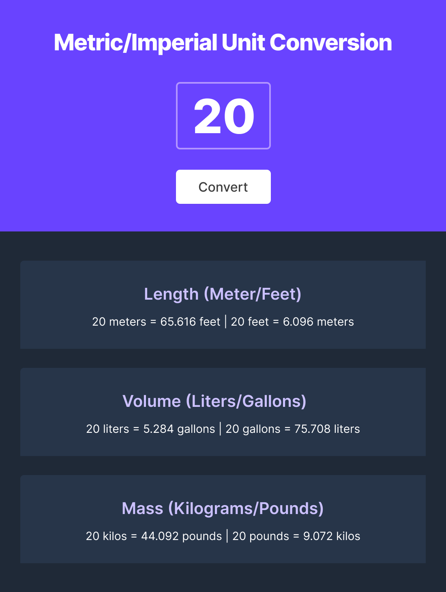

# Solo Scrimba Project
## Unit Converter
A solo project from the front-end web developer bootcamp at [Scrimba](https://scrimba.com/). The requirements are to create a webpage that converts different measurements from metric to imperial units and vice versa. 

Link to the project: <a href="https://sassaman-unit-converter.netlify.app/" target="_blank">here</a>

### Requirements

- Follow the design spec [Figma file](https://www.figma.com/file/tgQZiPYCmUeCx6Tvym25Vp/Unit-Conversion-(Copy)?node-id=0%3A1&t=DTzRkSrACs54oYM3-0)
- Generate all conversions when user clicks "convert"
- Round the numbers down to three decimal places

### Tech Used
- CSS
- HTML
- Vanilla JavaScript
- Figma (for design purposes)

### To-Do
- [x] Refactor JS
- [x] Have local storage remember the conversion and create a reset button to reset the data
- [x] Responsive sizing
